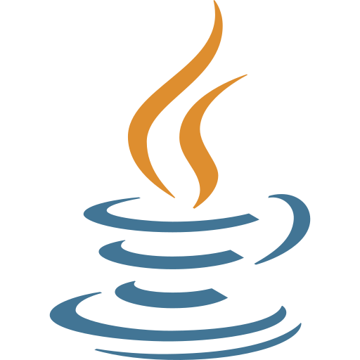
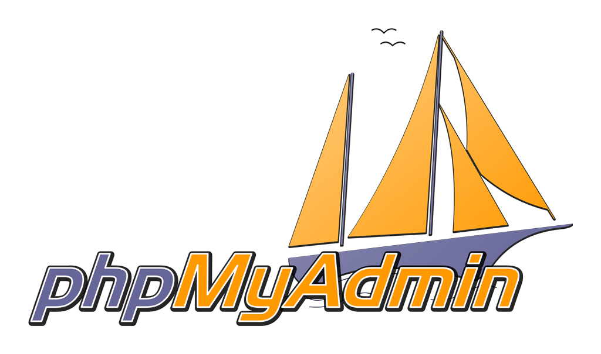
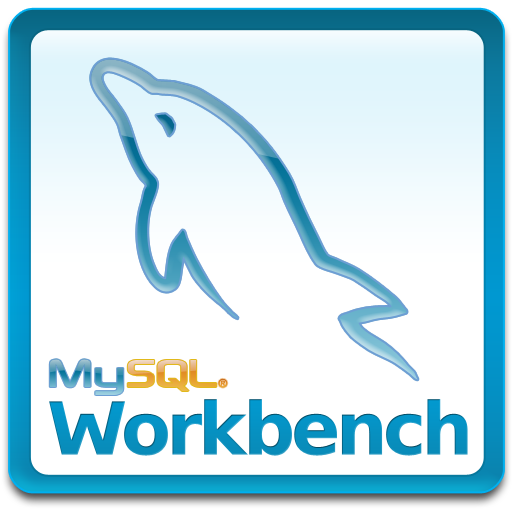
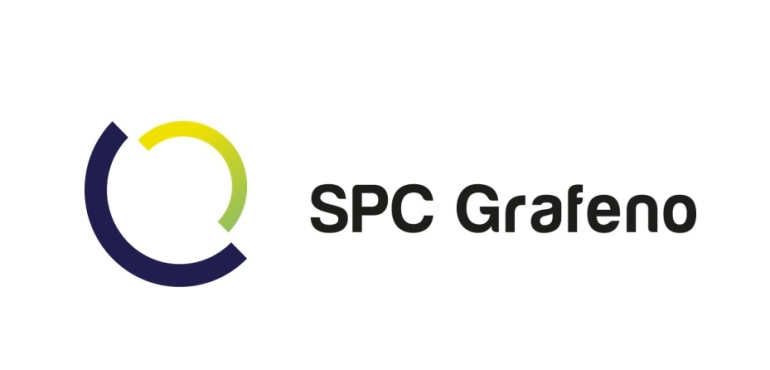

# Portfólio •  Júlia Pereira Quitério

__Repositório Dedicado ao Portfólio do API | Banco de Dados__

Este repositório apresenta o Portfólio de Projetos Integradores (APIs), desenvolvidos para aplicar o aprendizado obtido em sala de aula e maximizar a assimilação do conhecimento. O Trabalho de Graduação (TG) na modalidade Portfólio das Aprendizagens foi elaborado com base nesses Projetos Integradores e apresentado à Faculdade de Tecnologia de São José dos Campos como requisito para a obtenção do título de Tecnóloga em Banco de Dados.


# 👋 Bem vindo(a)! 

💾 **Analista de Dados | Estudante de Banco de Dados**  
🎓 **Fatec São José dos Campos**  

🚀 Apaixonada por tecnologia e dados, sempre buscando aprender e criar soluções inovadoras.  


# Sobre mim

<p align="center"></p>


<br>

Me chamo Júlia Pereira Quitério, tenho 22 anos e sou estudante de Banco de Dados (6º semestre) na Fatec São José dos Campos (SP)| Prof. Jessen Vidal.  Contando um pouco sobre mim, minha paixão pela tecnologia começou no curso técnico de Análise e Desenvolvimento de Sistemas (ADS) na ETEC de Caçapava (SP). Especificamente a matéria de Banco de dados foi o que brilhou meus olhos, e foi ali que descobri meu interesse pela área de Dados e decidi seguir carreira nesse universo na Fatec por ser a mesma entidade que a Etec (CPS - Centro Paula Souza).

Ao ingressar na Fatec, aprofundei meus conhecimentos e tive a oportunidade de iniciar minha trajetória profissional como estagiária em Dados na mesma empresa que estou hoje, Elo Cartões uma empresa especializada em meios de pagamento e 100% brasileira. Fui efetivada 1 ano após o estágio e hoje como Analista de Dados trabalho com SQL, DBT (data build tools), automações, modelagem e estruturação de dados, inteligência de negócios, entre outros, onde aplico e aprimoro diariamente minhas habilidades que adquiri principalmente na faculdade.

Busco constantemente destacar e expandir meus aprendizados, estando sempre aberta a novos desafios. Minha experiência em projetos envolvendo APIs  foi fundamental para o desenvolvimento das minhas habilidades técnicas (hard skills) e interpessoais (soft skills), tornando minha abordagem profissional ainda mais completa.


# Contatos
📧 juliapquiterio@gmail.com <br>
🤝 <a href="https://www.linkedin.com/in/j%C3%BAlia-quit%C3%A9rio-934894205/">LinkedIn</a> <br>
🧑‍💻 <a href="https://github.com/juliaquiterio">GitHub</a>


# Meus principais conhecimentos

Sou apaixonada pelo mundo dos dados, mas também possuo amplo conhecimento em tecnologias voltadas para desenvolvimento back-end e projetos. Entre todos meus conhecimentoss, se destacam:

* Java
* Python
* Spring Framework
* SQL
* HTML
* JavaScript
* CSS
* Pacote Office
* Metodologia Scrum
* Ferramenta de Gestão (Teams, Slack, Jira)

<br>

# 📌 Projetos API


<details><summary>1º semestre</summary>


<h3> 1º semestre - 1/2022 </h3>

Parceiro Acadêmico: <a href="https://fatecsjc-prd.azurewebsites.net/">Fatec Prof. Jassen Vidal - São José dos Campos | Professor Fabiano Sabha</a>


<h4>Link do repositório:</h4>

<p align="left">
 <a href="https://github.com/juliaquiterio/GrupoCachinhos">Acesse aqui</a>
</p>

<div align="center">


</div>


<h2>Assistente Virtual de Viagens</h2>

<h3>📌 Descrição do Projeto</h3>
Mó Viagem é uma assistente virtual feita em aplicação web desenvolvida na linguagem de programação <a href="https://www.python.org/">Python</a>, criada para auxiliar turistas a planejar roteiros de viagem. Nossa missão é mostrar aos usuários como eles podem explorar e aproveitar ao máximo as belezas de seu próprio país, muitas vezes ainda desconhecidas ou subestimadas.


<h4><li><b>Desafio</b></li></h4>
        <p align="justify">
       O professor Fabiano Sabha, que representa o nosso cliente, propôs o desafio de criar uma assistente virtual utilizando python como linguagem principal, ficando a critério do Grupo do API escoher a finalidade para tal.
        </p>


<h2>💻 Tecnologias aplicadas</h2>


<details><summary>Saiba  mais</summary>


</p>
          <a href="https://www.python.org/">Python</a>
          <p align="justify">
         O Python é uma linguagem de programação amplamente usada em aplicações da Web, desenvolvimento de software, ciência de dados e machine learning (ML).No projeto foi utilizado com um dos requisitos especificados e foi a principal linguagem para construção da aplicacão web. Abaixo tenho listadas as bibliotecas que utilizamos: </p>

<h3>Bibliotecas Python</h3>

- **SpeechRecognition**: Reconhece e interpreta fala humana.
- **PyAudio**: Interface Python para trabalhar com áudio.
- **API OpenWeather**: Acessa dados meteorológicos em tempo real.
- **Pandas**: Analisa e manipula dados.
- **Wikipédia**: Busca e recupera conteúdo da Wikipédia.
- **Requests**: Simplifica requisições HTTP.
- **Translator**: Traduz textos entre idiomas.
- **Holidays**: Informa sobre feriados em diversos países.
- **Re**: Pesquisa e manipula texto com expressões regulares.
- **Webbrowser**: Abre URLs no navegador padrão.
- **Pyttsx3**: Síntese de voz no Python.

</details>

<h2>Contribuições pessoais</h2>
<details>
    <summary>Saiba mais</summary>

  __Desenvolvimento do Roteiro e Curiosidades:__
   Como desenvolvedora eu pude lidar com a Tecnologia do Python , utilizando as bibliotecas da Wikipedia, PyAudio,  Re e Webbrower. Utilizei a junção dessas bibliotecas para que o Usuário pudesse saber mais sobre os roteiros das cidades onde ele buscava a partir de uma chamada HTTPS na Wikipedia como referencia. O usuário conseguia ouvir e assim ter uma gama de roteiros em que ele pudesse explorar e saber sobre curiosidades daquele local que ele estava perguntando a Assistente Virtual.

Veja abaixo um exemplo do Script:

```
#Roteiro de viagens
        elif "roteiro" in texto:
            convertFala("Qual cidade você quer conhecer")

            rec = sr.Recognizer()

            with sr.Microphone() as mic:
                print("Por favor, fale o nome da cidade para saber o roteiro de viagem: ")
                rec.adjust_for_ambient_noise(mic)
                audio = rec.listen(mic)

            roteiro = rec.recognize_google(audio, language="pt-BR")

            wikipedia.set_lang('pt')

            resposta = wikipedia.page(roteiro)
            print('Roteiro da cidade escolhida: ', roteiro)
            print('\n')
            print("Caso retorne em branco não foi encontrado o roteiro da cidade desejada.")

            conteudo = resposta.section(section_title='Turismo')
            conteudo2 = resposta.section(section_title='Cultura')

            print(conteudo)
            convertFala(conteudo)

            print("Cultura da cidade:", roteiro)
            print('\n')
            print(conteudo2)
            convertFala(conteudo2)
            # A biblioteca wikipedia RETORNA NONE para subtópicos, ainda que correspondam ao tópico 'Turismo/Cultura' (função elif/else não funciona neste caso)
            print('')
```


```
 #Curiosidades
        elif "curiosidades" or "curiosidade" in texto:
            
            convertFala("Quer conhecer qual cidade")
            rec = sr.Recognizer()

            with sr.Microphone() as mic:
                print("Por favor, fale o nome da cidade para saber as curiosidades: ")
                rec.adjust_for_ambient_noise(mic)
                audio = rec.listen(mic)

            curiosidade = rec.recognize_google(audio, language="pt-BR")
                      
            wikipedia.set_lang('pt')
            
            resposta = wikipedia.summary(curiosidade, sentences=2)
            print(resposta)
            convertFala(resposta)
            
        #Lista de Desejos
        elif "desejo" in texto:
            convertFala("Você deseja visualizar a lista ou adicionar")
            print("\n")
            print("1- Visualizar")
            print("2- Adicionar")
            print("\n")

            rec = sr.Recognizer()

            with sr.Microphone() as mic:
                print("Escolha uma opção: ")
                rec.adjust_for_ambient_noise(mic)
                audio = rec.listen(mic)

            resposta = rec.recognize_google(audio, language="pt-BR")

            if ("visualizar" in resposta):
                arquivo = open('lista.txt', 'r')
                print("----Lista de Desejos----")

                for linha in arquivo:
                    print(linha.rstrip())
                    convertFala(linha.rstrip())

                print("Para retirar um destino da lista, vá até o arquivo lista.txt e elimine o que desejar")
                convertFala("Para retirar ou alterar um destino da lista, vá até o arquivo lista.txt e elimine ou altere o que desejar")
                arquivo.close()

            elif ("adicionar" in resposta):
                from classe import listadesejo
                arquivos.append(listadesejo())
                arquivo = open('lista.txt', 'a')

                convertFala("Qual cidade você deseja visitar")
                rec = sr.Recognizer()

                with sr.Microphone() as mic:
                    print("Qual o nome da cidade: ")
                    rec.adjust_for_ambient_noise(mic)
                    audio = rec.listen(mic)

                nomecidade = rec.recognize_google(audio, language="pt-BR")

                arquivos[contador].setnomecidade(nomecidade)

                convertFala("Qual o nome do estado brasileiro")
                rec2 = sr.Recognizer()

                with sr.Microphone() as mic:
                    print("Qual o nome do estado: ")
                    rec2.adjust_for_ambient_noise(mic)
                    audio = rec2.listen(mic)

                estado = rec2.recognize_google(audio, language="pt-BR")

                arquivos[contador].setestado(estado)

                convertFala("Quais são os pontos turísticos")
                rec3 = sr.Recognizer()

                with sr.Microphone() as mic:
                    print("Quais os pontos turísticos: ")
                    rec3.adjust_for_ambient_noise(mic)
                    audio = rec3.listen(mic)

                ponto = rec3.recognize_google(audio, language="pt-BR")

                arquivos[contador].setponto(ponto)

                arquivo.write("--------------------" + "\n")
                arquivo.write("Nome da Cidade:" + arquivos[contador].getnomecidade() + "\n")
                arquivo.write("Nome do Estado:" + arquivos[contador].getestado() + "\n")
                arquivo.write("Pontos Turísticos:" + arquivos[contador].getponto() + "\n")
                arquivo.write("--------------------" + "\n")
                arquivo.close()

                print("Destino adicionado com sucesso")
                convertFala("Destino adicionado com sucesso")
            else:
                convertFala("Não entendi, poderia repetir")
```

<h2>Lições Aprendidas</h2>


<p>
Como desenvolvedora, tive a oportunidade de aprender, inicialmente, sobre o que é um Projeto Integrador na faculdade, o que contribuiu significativamente para meu desenvolvimento tanto educacional quanto profissional. Nesse processo, pude vivenciar o desenvolvimento de um projeto do zero, trabalhando em equipe, lidando com um cliente e, acima de tudo, enfrentando desafios. Aprendi novas formas de desenvolver meu raciocínio lógico e aplicar os conhecimentos adquiridos ao projeto. Além disso, atuei no Backend, utilizando bibliotecas do  Python com as quais ainda não havia trabalhado, explorando sua performance e entendendo como poderiam beneficiar o projeto.
</p>


</details>


<br>

   <h3>Hard Skills:</h3>

✅✅✅⬜⬜ **Python**  
Pude aplicar os conhecimentos adquiridos tanto em sala de aula quanto por conta própria, utilizando Python como ferramenta essencial para o desenvolvimento do projeto, uma vez que era um dos requisitos da API.  


✅✅✅✅⬜ **Lógica de Programação**  
Foi fundamental para todo o desenvolvimento, auxiliando na compreensão do problema e na escrita de um código mais limpo, organizado e eficiente.  


✅✅✅✅✅ **Metodologia Ágil | Scrum**  
Adotei essa metodologia na gestão do projeto junto à minha equipe, organizando as sprints de forma eficiente. Dessa forma, pude aplicar na prática os conceitos aprendidos em sala de aula e em cursos, garantindo um fluxo de trabalho mais produtivo e estruturado.  


   <h3>Soft Skills:</h3>

✅✅✅✅✅ **Organização**  
Pude usar essa minha soft skill para me organizar nas minhas atividades e nos meus estudos e isso foi essencial para todo o desenvolvimento do projeto.  


✅✅✅✅⬜ **Proatividade**  
Fui proativa em saber reconhecer que se minha equipe estava precisando de apoio eu estudei sobre os roteiros e pesquisei mais para poder auxiliá-los. E fui atrás das coisas das quais não sabia ainda, seja procurando os professores ou pesquisando na internet.  


✅✅✅✅✅ **Trabalho em equipe**  
Esse foi um dos tópicos mais importantes pois sem ele não seria possível fazermos uma entrega tão eficiente do nosso produto. Soube lidar com situações e agirmos em grupo nas atividades, assim conseguimos conciliá-la e entregá-las com eficiência.  


<h3>📽️ Vídeo demonstrativo do projeto</h3>


<a href="https://youtu.be/sMsg5akNBOQ?feature=shared">Assista aqui</a>

</details>


----

<details><summary>2º semestre</summary>


<h3> 2º semestre - 2/2022 </h3>

Parceiro Acadêmico: <a href="https://www.pro4tech.com.br/">Pro4Tech</a>


<h4>Link do repositório:</h4>

<p align="left"><a href="https://github.com/Codados/PRO4Jobs">Acesse aqui</a></p>

<div align="center">


</div>


<h2>Pro4Jobs</h2>

<h3>📌 Descrição do Projeto</h3>
Pro4Jobs é uma aplicação Desktop com o objetivo de gerenciar vagas de emprego, otimizar o trabalho das pessoas do setor de Recursos Humanos.


<h4><li><b>Desafio</b></li></h4>
        <p align="justify">
       O cliente da Pro4Tech nos desafiou a criar uma aplicação DeskTop para auxiliar o setor de Recursos Humanos para gerenciar as vagas de emprego da empresa.Foi usada a linguagem Java como principal para o desenvolvimento da aplicação.
        </p>


<h2>💻 Tecnologias aplicadas</h2>

<details><summary>Saiba  mais</summary>



</p>
          <a href="https://www.python.org/">JAVA</a>
          <p align="justify">
         Java é uma linguagem de programação orientada a objetos, lançada em 1995, conhecida por ser multiplataforma graças à JVM. É usada em aplicativos web, móveis e sistemas corporativos, valorizada por sua segurança e robustez. No projeto foi utilizado com um dos requisitos especificados e foi a principal linguagem para construção da aplicacão web. Abaixo tenho listadas as bibliotecas que utilizamos: </p>



<a href="https://www.phpmyadmin.net/">PHPAdmin</a>
          <p align="justify">
         PHPAdmin é uma ferramenta de administração de bancos de dados MySQL ou MariaDB baseada na web, escrita em PHP. Ela permite gerenciar facilmente bancos de dados, tabelas, colunas, registros e usuários através de uma interface amigável, sem necessidade de comandos SQL complexos. Usamos para manipular as consultas no banco de dados. </p>





<a href="https://www.mysql.com/products/workbench/">MySQL Workbench</a>
          <p align="justify">
         O MySQL Workbench é uma ferramenta gráfica oficial para gerenciar bancos de dados MySQL. Ele facilita tarefas como criação de tabelas, execução de consultas, backup e modelagem de dados com diagramas ER, sendo muito usado para administrar e visualizar bancos de dados. </p>


<a href="https://www.oracle.com/br/database/">Oracle</a>
          <p align="justify">
         O Oracle Database é um sistema de banco de dados robusto e escalável, projetado para gerenciar grandes volumes de dados em empresas. Ele oferece alta segurança, disponibilidade e suporte para transações complexas, sendo popular em ambientes corporativos. </p>
</details>


<h2>Contribuições pessoais</h2>
<details>
    <summary>Saiba mais</summary>

  __Desenvolvimento Relatório do RH:__
   Como desenvolvedora, tive a oportunidade de trabalhar com a tecnologia Java, utilizando-a para desenvolver uma funcionalidade que permite ao usuário acessar o relatório geral das vagas de emprego de forma prática e eficiente.

Veja abaixo um exemplo do Script (Parcial):

```
/*
 * Click nbfs://nbhost/SystemFileSystem/Templates/Licenses/license-default.txt to change this license
 * Click nbfs://nbhost/SystemFileSystem/Templates/GUIForms/JFrame.java to edit this template
 */
package View;

import DAO.ConexaoDAO;
import java.io.File;
import java.io.FileWriter;
import java.io.PrintWriter;
import java.sql.Connection;
import java.sql.PreparedStatement;
import java.sql.ResultSet;
import java.sql.SQLException;

/**
 *
 * @author apqui
 */
public class RelatorioRH extends javax.swing.JFrame {

    Connection conn;
    PreparedStatement pstm;
    ResultSet rs;

    /**
     * Creates new form RelatorioRH
     */
    public RelatorioRH() {
        initComponents();
    }

    /**
     * This method is called from within the constructor to initialize the form.
     * WARNING: Do NOT modify this code. The content of this method is always
     * regenerated by the Form Editor.
     */
    @SuppressWarnings("unchecked")
    // <editor-fold defaultstate="collapsed" desc="Generated Code">//GEN-BEGIN:initComponents
    private void initComponents() {

        jButton3 = new javax.swing.JButton();
        Candidatos = new javax.swing.JButton();
        btnVagas = new javax.swing.JButton();
        RH = new javax.swing.JButton();
        Aprovados = new javax.swing.JButton();
        jButton1 = new javax.swing.JButton();
        jLabel2 = new javax.swing.JLabel();

        jButton3.setText("jButton3");

        setDefaultCloseOperation(javax.swing.WindowConstants.EXIT_ON_CLOSE);
        getContentPane().setLayout(new org.netbeans.lib.awtextra.AbsoluteLayout());

        Candidatos.setFont(new java.awt.Font("Arial", 1, 18)); // NOI18N
        Candidatos.setForeground(new java.awt.Color(255, 255, 255));
        Candidatos.setText("Candidatos");
        Candidatos.setBorder(null);
        Candidatos.setBorderPainted(false);
        Candidatos.setContentAreaFilled(false);
        Candidatos.addActionListener(new java.awt.event.ActionListener() {
            public void actionPerformed(java.awt.event.ActionEvent evt) {
                CandidatosActionPerformed(evt);
            }
        });
        getContentPane().add(Candidatos, new org.netbeans.lib.awtextra.AbsoluteConstraints(10, 200, 260, 40));

        btnVagas.setFont(new java.awt.Font("Arial", 1, 18)); // NOI18N
        btnVagas.setForeground(new java.awt.Color(255, 255, 255));
        btnVagas.setText("Vagas");
        btnVagas.setBorderPainted(false);
        btnVagas.setContentAreaFilled(false);
        btnVagas.addActionListener(new java.awt.event.ActionListener() {
            public void actionPerformed(java.awt.event.ActionEvent evt) {
                btnVagasActionPerformed(evt);
            }
        });
        getContentPane().add(btnVagas, new org.netbeans.lib.awtextra.AbsoluteConstraints(20, 310, 240, 50));

        RH.setFont(new java.awt.Font("Arial", 1, 18)); // NOI18N
        RH.setForeground(new java.awt.Color(255, 255, 255));
        RH.setText("RH");
        RH.setBorderPainted(false);
        RH.setContentAreaFilled(false);
        RH.addActionListener(new java.awt.event.ActionListener() {
            public void actionPerformed(java.awt.event.ActionEvent evt) {
                RHActionPerformed(evt);
            }
        });
        getContentPane().add(RH, new org.netbeans.lib.awtextra.AbsoluteConstraints(40, 370, 200, 40));

        Aprovados.setFont(new java.awt.Font("Arial", 1, 18)); // NOI18N
        Aprovados.setForeground(new java.awt.Color(255, 255, 255));
        Aprovados.setText("Aprovados");
        Aprovados.setBorderPainted(false);
        Aprovados.setContentAreaFilled(false);
        Aprovados.addActionListener(new java.awt.event.ActionListener() {
            public void actionPerformed(java.awt.event.ActionEvent evt) {
                AprovadosActionPerformed(evt);
            }
        });
        getContentPane().add(Aprovados, new org.netbeans.lib.awtextra.AbsoluteConstraints(70, 260, -1, 40));

        jButton1.setFont(new java.awt.Font("Arial", 1, 14)); // NOI18N
        jButton1.setForeground(new java.awt.Color(255, 255, 255));
        jButton1.setText("Sair");
        jButton1.setBorderPainted(false);
        jButton1.setContentAreaFilled(false);
        jButton1.addActionListener(new java.awt.event.ActionListener() {
            public void actionPerformed(java.awt.event.ActionEvent evt) {
                jButton1ActionPerformed(evt);
            }
        });
        getContentPane().add(jButton1, new org.netbeans.lib.awtextra.AbsoluteConstraints(570, 480, 130, 30));

        jLabel2.setIcon(new javax.swing.ImageIcon(getClass().getResource("/Images/tela_relat_princ.png"))); // NOI18N
        getContentPane().add(jLabel2, new org.netbeans.lib.awtextra.AbsoluteConstraints(0, -10, 730, 530));

        pack();
    }// </editor-fold>//GEN-END:initComponents

    private void CandidatosActionPerformed(java.awt.event.ActionEvent evt) {//GEN-FIRST:event_CandidatosActionPerformed
        Create_Candidato_Csv();    }//GEN-LAST:event_CandidatosActionPerformed

    private void btnVagasActionPerformed(java.awt.event.ActionEvent evt) {//GEN-FIRST:event_btnVagasActionPerformed
        // TODO add your handling code here:
        Create_Vaga_Csv();
    }//GEN-LAST:event_btnVagasActionPerformed

    private void jButton1ActionPerformed(java.awt.event.ActionEvent evt) {//GEN-FIRST:event_jButton1ActionPerformed
            // TODO add your handling code here:
        System.exit(0);
    }//GEN-LAST:event_jButton1ActionPerformed

    private void AprovadosActionPerformed(java.awt.event.ActionEvent evt) {//GEN-FIRST:event_AprovadosActionPerformed
        // TODO add your handling code here:
        Create_Aprovados_Csv();
    }//GEN-LAST:event_AprovadosActionPerformed

    private void RHActionPerformed(java.awt.event.ActionEvent evt) {//GEN-FIRST:event_RHActionPerformed
        // TODO add your handling code here:
        Create_rh_Csv();
    }//GEN-LAST:event_RHActionPerformed

```


```
 <?xml version="1.0" encoding="UTF-8" ?>

<Form version="1.3" maxVersion="1.9" type="org.netbeans.modules.form.forminfo.JFrameFormInfo">
  <NonVisualComponents>
    <Component class="javax.swing.JButton" name="jButton3">
      <Properties>
        <Property name="text" type="java.lang.String" value="jButton3"/>
      </Properties>
    </Component>
  </NonVisualComponents>
  <Properties>
    <Property name="defaultCloseOperation" type="int" value="3"/>
  </Properties>
  <SyntheticProperties>
    <SyntheticProperty name="formSizePolicy" type="int" value="1"/>
    <SyntheticProperty name="generateCenter" type="boolean" value="false"/>
  </SyntheticProperties>
  <AuxValues>
    <AuxValue name="FormSettings_autoResourcing" type="java.lang.Integer" value="0"/>
    <AuxValue name="FormSettings_autoSetComponentName" type="java.lang.Boolean" value="false"/>
    <AuxValue name="FormSettings_generateFQN" type="java.lang.Boolean" value="true"/>
    <AuxValue name="FormSettings_generateMnemonicsCode" type="java.lang.Boolean" value="false"/>
    <AuxValue name="FormSettings_i18nAutoMode" type="java.lang.Boolean" value="false"/>
    <AuxValue name="FormSettings_layoutCodeTarget" type="java.lang.Integer" value="1"/>
    <AuxValue name="FormSettings_listenerGenerationStyle" type="java.lang.Integer" value="0"/>
    <AuxValue name="FormSettings_variablesLocal" type="java.lang.Boolean" value="false"/>
    <AuxValue name="FormSettings_variablesModifier" type="java.lang.Integer" value="2"/>
    <AuxValue name="designerSize" type="java.awt.Dimension" value="-84,-19,0,5,115,114,0,18,106,97,118,97,46,97,119,116,46,68,105,109,101,110,115,105,111,110,65,-114,-39,-41,-84,95,68,20,2,0,2,73,0,6,104,101,105,103,104,116,73,0,5,119,105,100,116,104,120,112,0,0,2,6,0,0,2,-38"/>
  </AuxValues>

```

  __Organização do Readme do Projeto:__
   Como desenvolvedora eu pude organizar e ccentralizar as principais informações do projeto no Readme para que o usuário que for ler entenda as principais ideias e demais informações  importantes do projeto.

Veja abaixo um exemplo do Script (Parcial):

```
<h1 align="center"> Grupo Codados</h1>


<p align = "center">

</p>
<br>

## Sobre o Projeto PRO4Jobs :desktop_computer:

* PRO4Jobs é uma aplicação Desktop com o objetivo de gerenciar vagas de emprego, otimizar o trabalho das pessoas do setor de Recursos Humanos;
* O Candidato poderá vizualizar e se candidatar as vagas de emprego que o RH disponibilizará;
* Este Projeto tem como Cliente a empresa PRO4TECH;
* A aplicação tem como linguagem de programação o Java, pois foi a linguagem designada para o Segundo Semestre de Banco de Dados;
* Para registrar vagas, candidatos e o pessoal do RH, é necessário a criação de um Banco de Dados, o qual será conectado com a linguagem Java;
* Utilizando a Metodologia Scrum, a equipe pode desenvolver este Projeto com agilidade, qualidade e boa organização.
<br>

## Informações sobre o Cliente :technologist:

| Cliente | Contato |
| --- | --- |
| `Rafael Monteiro` | rafael.monteiro@pro4tech.com.br |

<br>
...
```

<h2>📚 Lições Aprendidas</h2>


<p>

Como desenvolvedora, tive a oportunidade de aprender e aplicar técnicas avançadas em Java, utilizando a linguagem para criar soluções eficazes em minhas aplicações. Essa prática me permitiu aprimorar minhas habilidades e entender o valor real desses conceitos, aplicando com sucesso o que aprendi em sala de aula e elevando a qualidade dos projetos desenvolvidos.

Durante esse projeto, aprimorei minhas habilidades em:

* Manipulação de banco de dados com Java (JDBC)
* Criação de interfaces gráficas com Swing
* Organização e documentação de sistemas via README
* Práticas ágeis com a metodologia Scrum

</p>


[🔗 Clique para ver demonstração em vídeo](Tela_Candidatos.mp4)


</details>

<br>


   __Hard Skills:__ <br>
✅✅✅⬜⬜ **JAVA**  
Pude aplicar os conhecimentos adquiridos em sala de aula sobre a linguagem de programação de JAVA no projeto e foi essencial para que eu pudesse entender mais sobre a linguagem e orientação de objetos.  
✅✅✅✅⬜ **Markdown**  
Utilizei a linguagem de marcação para documentação de todo o nosso projeto e foi muito bom para entender  organizar de forma mais visual todo o escopo.  
✅✅✅✅✅**Metodologia Ágil | Scrum**  
Adotei essa metodologia na gestão do projeto junto à minha equipe, organizando as sprints de forma eficiente. Dessa forma, pude aplicar na prática os conceitos aprendidos em sala de aula e em cursos, garantindo um fluxo de trabalho mais produtivo e estruturado.
   

   __Soft Skills:__ <br>
✅✅✅✅⬜ **Comunicação:** A comunicação foi essencial para que pudéssemos ter um diálogo aberto para com a equipe e com o nosso cliente, onde utilizamos o Slack e as aulas para retirar as dúvidas.  
✅✅✅⬜⬜ **Trabalho em equipe:** O trabalho em equipe esteve presente em todo o desenvolvimento mas há oportunidade de melhoria, pois o grupo poderia ter mais união  para auxiliar oscolegas, digo isso por uma visão geral do grupo como um todo.  
 


</details>


----

<details><summary>3º semestre</summary>

<h3> 3º semestre - 1/2023 </h3>

Parceiro Acadêmico: <a href="https://www.domrock.net/">Dom Rock</a>


<h4>Link do repositório:</h4>

<p align="left">
 <a href="https://github.com/equipe-vox/api-3sem">Acesse aqui</a>
</p>

<div align="center">


</div>


<h2>Sistema de Gerenciamento de Vendas</h2>

<h3>📌 Descrição do Projeto</h3>
Sales Vox é uma aplicação web de um Sistema de Gerenciamento de Vendas com foco em auxiliar os vendedores a terem uma visão sobre suas vendas e o administrador que poderia ter um controle geral sobre.

<h4><li><b>Desafio</b></li></h4>
        <p align="justify">
       A empresa Dom Rock lançou um desafio aos alunos do curso de Banco de Dados para que auxiliasse na resolução para um obstáculo que era acompanhar alguns KPI's através de Dashboards de um sistema  de Gerenciamento de Vendas. Como solução geramos uma aplicação WEB  com Spring Boot possibilitando que o usuário acompanhasse 
o andamento das vendas e pudesse tirar algumas respostas através do que os dados informavam.
        </p>


<h4>💻 Tecnologias aplicadas</h4>

<details><summary>Saiba  mais</summary>


</p>
          <li><a href="https://spring.io/">Spring Framework</a></li>
          <p align="justify">
         Segundo <a href="https://www.treinaweb.com.br/blog/o-que-e-o-spring-boot/">TreinaWeb</a> o Spring Boot é um framework que torna fácil a criação de aplicações Spring autossuficientes e robustas, possibilitando a execução imediata. Contudo isso só é possível por conta da abordagem opinativa sobre a plataforma Spring e bibliotecas de terceiros, que permite ao desenvolvedor gastar o mínimo de tempo possível configurando o projeto, e sim codificando suas regras de negócio. Foi utilizado como o principal framework para o desenvolvimento da aplicação web e foi de grande importância para o mesmo, facilitando o processo ao longo das sprints.</p>
          
          <li><a href="https://www.figma.com/">Figma</a></li>
          <p align="justify">
          Segundo <a href="https://www.alura.com.br/artigos/figma">Alura</a> o Figma é uma plataforma colaborativa para construção de design de interfaces e protótipos, pertencente a empresa Fima, Inc. O objetivo era o de criar uma ferramenta que trouxesse colaboração entre pessoas e times, permitindo criar um produto para as mais diversas plataformas, mantendo a acessibilidade do sistema. Foi utilizado para o desenvolvimento do Front-end podendo colaborar de forma crucial para o desenvolvimento das telas em geral do projeto.</p>
          
          <li><a href="https://react.dev/">React</a></li>
          <p align="justify">
          O React, também conhecido como React.js ou ReactJS, é uma biblioteca de código aberto JavaScript amplamente utilizada para construir interfaces de usuário (UI) interativas e dinâmicas. É um componente fundamental no desenvolvimento de aplicativos web modernos e é especialmente popular para a criação de interfaces de usuário de página única (Single Page Applications - SPAs), de acordo
          <a href="https://kenzie.com.br/blog/react/.">Kenzie</a>. O React foi utilizado também para o desenvolvimento em parte do Front-end assim colaborando com a parte visual utilizando bibliotecas que apoiaram no desenvolvimento dos Dashboards.</p>
          
          <li><a href="https://www.apachefriends.org/pt_br/index.html">XAMPP</a></li>
          <p align="justify">
         Segundo  <a href="https://www.techtudo.com.br/noticias/2012/02/o-que-e-xampp-e-para-que-serve.ghtml">TechTudo</a> o XAMPP é um pacote com os principais servidores de código aberto do mercado, incluindo FTP, banco de dados MySQL e Apache com suporte as linguagens PHP e Perl. Foi utilizado para acesso ao nosso banco local como um servidor local.</p>
         
         <li><a href="">MySQL Workbench</a></li>
         <p align="justify">
         Segundo <a href="https://www.danielimamura.com.br/manual-completo-do-mysql-workbench/">Danieli Mamura</a> MySQL Workbench é a ferramenta oficial do MySQL. É um ambiente completo que permite além de realizar consultas, criar diagramas e trabalhar com engenharia reversa.Utilizamos para o desenvolvimento do DDL das tabelas que utilizamos em nossa aplicação.
         </p>
         </details>

<h3>Contribuições pessoais</h3>

<details><summary>Saiba mais</summary>


**Backend - Rota HTTPs Login do Vendedor**

  __Desenvolvimento da Tela de Login do Vendedor:__
   Como desenvolvedora eu pude lidar com a Tecnologia do Spring Boot focada no Backend onde usamos juntamente com a Arquitetura Rest podendo criar as rotas para o Login da persona (Vendedor), onde ele poderia acessar a rota permitindo o mesmo acessar a aplicação.


Segue o link abaixo das descrições para maior visibilidade:


```
@RestController
@CrossOrigin(origins = "*")
@RequestMapping("/vendedor")
public class VendedorController {

    @Autowired
    private VendedorRepository vendedorRepository;

@PostMapping("/login")
    public ResponseEntity<?> login(@RequestBody LoginRequest loginRequest) {
        String email = loginRequest.getEmail();
        String senha = loginRequest.getSenha();

        Vendedor vendedor = vendedorRepository.findByEmailAndSenha(email, senha);
        Admin admin = adminRepository.findByEmailAndSenha(email, senha);

        if (vendedor == null && admin == null) {
            return new ResponseEntity<Vendedor>(HttpStatus.BAD_REQUEST);
        }

        if (admin != null) {
            return new ResponseEntity<Admin>(admin, HttpStatus.OK);
        }

        return new ResponseEntity<Vendedor>(vendedor, HttpStatus.OK);
    }
```


<a href=https://github.com/equipe-vox/api-3sem/tree/main/api>Acesse aqui o repositório</a>


**Modelagem de dados - DDL**

__Apoio ao Desenvolvimento do Banco de Dados:__
 Fui responsável por dar o apoio a modelagem de Dados tanto as etapas de DER quanto MER e o DDL. Podendo aplicar os conhecimenro adquiridos em sala de aula.

 Segue abaixo um trecho do DDL:

 ```

create database banco;
use banco;

create table administrador(
    id bigint auto_increment primary key,
    email varchar(50) not null,
    nome varchar(50) not null,
    senha text not null
);

create table vendedor(
	id bigint auto_increment primary key,
	nome varchar(50) not null,
	nome_gerencia varchar(30) not null,
	senha text not null
);

create table cliente(
    id varchar(200) not null,
    cod_cliente varchar(200) not null,
    fk_vendedor bigint null,
    nome varchar(50) not null,
    primary key(id,cod_cliente),
    foreign key (fk_vendedor) references vendedor(id)
);

```


***Metodologia Ágil**
<p>Eu pude contribuir como Product Owner , mais conhecido como PO do nosso grupo Vox. Assim realizando o levantamento dos requisitos que mais faziam sentido. E em paralelo pude contribuir com o Back-end do projeto atuando tanto na parte do Banco de Dados, quanto no código. </br>
Sendo as atividades desempenhadas:
</p>
 
 - __Definição dos Requisitos:__ Como Product Owner eu pude fazer o Backlog do Produto que era alinhado de acordo com os requisitos prioritários do Produto seguindo a metodologia de projeto do Scrum Master, que defini seguindo o que seria de maior valor (entregável) a cada Sprint. E pude também montar o Burndown usando a ferramenta de Excel onde tinhamos uma maior visibilidade do tempo que estava percorrendo.

 Segue o link abaixo das descrições para maior visibilidade:

<a href= https://github.com/equipe-vox/api-3sem#backlog-do-produto>Backlog do Produto</a> •
<a href= https://github.com/equipe-vox/api-3sem#link-disponivel-do-burndown> Burndown do Produto</a>

<h3>📚 Lições Aprendidas</h3>
<p>
Como Desenvolvedora, pude aprimorar meu raciocínio lógico e aprofundar meus conhecimentos em Spring Boot, compreendendo na prática como utilizá-lo no desenvolvimento de aplicações reais. Além disso, tive a oportunidade de focar mais intensamente na parte de Banco de Dados, aplicando os conteúdos aprendidos em sala de aula para realizar a modelagem de dados de forma estruturada e eficiente, o que contribuiu diretamente para a qualidade técnica dos projetos.

Como Product Owner (PO), desenvolvi minha capacidade de comunicação com o cliente, entendendo a importância de ouvir, interpretar e traduzir as necessidades do negócio em requisitos claros para o time. Percebi também que a organização é essencial no processo de desenvolvimento, e que trabalhar em conjunto com os desenvolvedores para alinhar prazos e priorizar entregas de maior valor é fundamental para o sucesso do projeto.

Durante esse projeto, aprimorei minhas habilidades em:

- Modelagem e manipulação de dados
- Desenvolvimento de aplicações com Spring Boot
- Comunicação e alinhamento com stakeholders
- Organização e definição de prioridades no papel de PO
</p>


</details>


 <br>

   __Hard Skills:__ <br>
✅✅✅✅⬜ **JAVA**  
Pude aplicar os conhecimentos adquiridos em sala de aula sobre a linguagem de programação de JAVA no projeto e foi essencial para que eu pudesse entender mais sobre a linguagem e orientação de objetos.  
✅✅✅✅✅ **Markdown**  
Utilizei a linguagem de marcação para documentação de todo o nosso projeto e foi muito bom para entender  organizar de forma mais visual todo o escopo.  


   __Soft Skills:__ <br>
✅✅✅✅✅ **Organização:** A comunicação foi essencial para que pudéssemos ter um diálogo aberto para com a equipe e com o nosso cliente, onde utilizamos o Slack e as aulas para retirar as dúvidas.  
✅✅✅⬜⬜ **Proatividade:** Tive a proatividade de iniciar tasks que estavam travadas e  ajudei meus colegas que estavam com dificuldades para o desenvolvimento.  
 

 </details>


----

<details><summary>4º semestre</summary>


<h3> 4º semestre - 2/2023 </h3>

Parceiro Acadêmico: <a href="https://www.jaia.software/">Jaia</a>


<h4>Link do repositório:</h4>

<p align="left">
 <a href="https://github.com/Data-Team23/Jaia">Acesse aqui</a>
</p>

<div align="center">


</div>


<h2>Jaia</h2>

<h3>📌  Descrição do Projeto</h3>
Em um cenário onde a paisagem urbana se compõe de uma mistura de edifícios modernos e históricos, a empresa Jaia, apresentou um desafio significativo. A condução de inspeções prediais estava provando ser uma tarefa morosa e suscetível a imprecisões. Diante desse cenário, a Jaia buscou soluções inovadoras para otimizar esse processo crucial. A visão estratégica da empresa contemplou o desenvolvimento de um software de inspeção predial, projetado para revolucionar a abordagem atual. 


<h4><li><b>Desafio</b></li></h4>
        <p align="justify">
       A plataforma concebida promete oferecer uma experiência intuitiva, capacitando os inspetores a documentar minuciosamente detalhes relevantes e capturar evidências visuais de forma eficaz. Adicionalmente, a geração instantânea de relatórios abastecerá a tomada de decisões embasadas. A Jaia, reconhecendo a necessidade de aprimorar a qualidade e eficiência das inspeções, direcionou seus esforços para o desenvolvimento desse software inovador. O resultado obtido transcendeu as expectativas iniciais, beneficiando não somente a empresa, mas também elevando o padrão das inspeções prediais na esfera urbana, contribuindo, assim, para uma maior segurança e excelência nas estruturas urbanas.
	   </p>


<summary><h2>💻 Tecnologias aplicadas</h2></summary>

<details><summary>Saiba  mais</summary>


</p>
          <a href="https://www.java.com/pt-BR/">JAVA</a>
          <p align="justify">
         Java é uma linguagem de programação orientada a objetos, lançada em 1995, conhecida por ser multiplataforma graças à JVM. É usada em aplicativos web, móveis e sistemas corporativos, valorizada por sua segurança e robustez. No projeto foi utilizado com um dos requisitos especificados e foi a principal linguagem para construção da aplicacão web. Abaixo tenho listadas as bibliotecas que utilizamos: </p>


<a href="https://www.javascript.com/">JavaScript</a>
          <p align="justify">
         JavaScript é uma linguagem de programação usada para criar páginas da web interativas. É leve, dinâmica e funciona tanto no frontend quanto no backend. É essencial no desenvolvimento web, sendo compatível com navegadores e suportando frameworks como React e Angular.


<a href="https://vuejs.org/">VUE</a>
          <p align="justify">
        Vue.js é um framework JavaScript progressivo usado para construir interfaces de usuário e aplicações web dinâmicas. É leve, fácil de aprender e foca em componentes reutilizáveis, facilitando a integração com projetos existentes. Ele combina simplicidade com recursos avançados, como gerenciamento de estado e roteamento, por meio de bibliotecas adicionais.


<p>HTML</p>
          <p align="justify">
         HTML (Hypertext Markup Language) é uma linguagem de marcação de texto que serve para criar páginas web.
		 
		 


<a href="https://www.oracle.com/br/database/">Oracle</a>
          <p align="justify">
         O Oracle Database é um sistema de banco de dados robusto e escalável, projetado para gerenciar grandes volumes de dados em empresas. Ele oferece alta segurança, disponibilidade e suporte para transações complexas, sendo popular em ambientes corporativos. </p>		 
		 
</details>

<h2>Contribuições pessoais</h2>


<details><summary>Saiba mais</summary>
<p>Backend</p>

  __Desenvolvimento do DDL (Modelagem de dados):__
   Como desenvolvedora eu desenvolvi a modelagem de dados em DDL para que pudessemos ter a integridade e a normalização dos dados.

Veja abaixo um exemplo do Script (Parcial):

```
create table endereco(
    id_end number(2) constraint pk_id_end primary key
    ,logradouro_end varchar(50) not null
    ,numero_end number(10) not null
    ,bairro_end varchar(50) not null
    ,cidade_end varchar(50) not null
    ,uf_end varchar(2) not null
);
create table cliente(
    cnpj_cli number(14) constraint pk_cli_cnpj primary key
    ,nome_cli varchar(100) not null
    ,telefone_cli number(14) constraint uk_cli_tel unique not null
    ,senha_cli varchar(200) not null
    ,fk_id_end number(2)
    ,constraint fk_cli_id_end foreign key(fk_id_end) references endereco(id_end)
    );
create table requisicao(
    id_req number(2) constraint pk_req_id_req primary key
    ,inspecao_req varchar(20) not null
    ,descricao_req varchar(200) not null
    ,status_req varchar(20) not null
    ,data_abertura_req date default sysdate
);
```


  __Desenvolvimento da classe de Departamento:__
   Como desenvolvedora eu desenvolvi a classe de Departamento. Foi desenvolvido em Java e separado 4 classes, sendo elas:
   
   - Departamento Service 
   - Departamento Repository
   - Departamento Controller
   -Interface: IDepartamento Service 
   

Veja abaixo um exemplo do Script (Parcial):

__Departamento Service:__

```
@Service
public class DepartamentoService implements IDepartamentoService {
    
    @Autowired
    private DepartamentoRepository departRepo;
    @Transactional
    @Override
    public Departamento novoDepartamento(Departamento departamento){
        if(departamento == null||
                departamento.getCod_depart() == null ||
                departamento.getNome_depart() == null ||
                departamento.getNome_depart().isBlank())
            throw new IllegalArgumentException("Departamento com atributos inválidos");
    Departamento departamentoNovo = departRepo.save(departamento);
    return departamentoNovo;
}
```

__Departamento Controller:__


```
@RestController
@RequestMapping(value = "/departamentos")
@CrossOrigin
public class DepartamentoController {
    @Autowired
    private IDepartamentoService service;
    @PostMapping
    public Departamento novoDepartamento(@RequestBody Departamento departamento) {
        return service.novoDepartamento(departamento);
    }
}
```


<h3>📚 Lições Aprendidas</h3>


<p>
Como Desenvolvedora, tive a oportunidade de aprender e aplicar técnicas avançadas em Java, utilizando a linguagem para criar soluções eficazes nas aplicações desenvolvidas. Essa prática contribuiu diretamente para o aprimoramento das minhas habilidades técnicas e para uma compreensão mais profunda dos conceitos vistos em sala de aula, elevando significativamente a qualidade dos projetos.

Durante esse projeto, também pude utilizar HTML para construção de interfaces e aplicar metodologias ágeis, como Scrum, para organizar e acompanhar o progresso do time de forma eficiente. Essa vivência reforçou a importância da colaboração, da comunicação clara e da proatividade no ambiente de trabalho, resultando em entregas mais alinhadas com os objetivos do negócio.

Durante esse projeto, aprimorei minhas habilidades em:

- Programação orientada a objetos com Java  
- Criação de interfaces com HTML  
- Aplicação da Metodologia Ágil (Scrum) no desenvolvimento  
- Comunicação eficaz e trabalho em equipe  
- Proatividade na identificação e resolução de problemas
</p>


</details>

<br>


   __Hard Skills:__ <br>
✅✅✅✅⬜ **Modelagem de Dados (DDL)**
Fui responsável pela criação do script DDL, garantindo a integridade e normalização do banco de dados com uso adequado de constraints, foreign keys e relacionamentos entre tabelas como endereco, cliente e requisicao.  
✅✅✅✅⬜ **Spring Boot**
Utilizei o Spring Boot para estruturar e gerenciar os serviços e endpoints REST, permitindo uma integração eficiente com o banco de dados e facilitando a manutenção do sistema.  
✅✅✅✅⬜ **SQL**
Implementei consultas e criações de tabelas utilizando SQL puro, reforçando meus conhecimentos em comandos como CREATE TABLE, PRIMARY KEY, FOREIGN KEY e DEFAULT.  

   __Soft Skills:__ <br>
✅✅✅✅✅ **Comunicação:** Trabalhei de forma colaborativa com os colegas de equipe, alinhando as entregas de cada parte do projeto e garantindo que todos estivessem na mesma página. A comunicação também foi essencial no contato com o cliente.  
✅✅✅✅⬜ **Organização:** Estruturei os códigos e scripts de forma clara, separando responsabilidades e mantendo um padrão que facilitasse a leitura e manutenção futura.  

</details>

----

<details><summary>5º semestre</summary>

<h3> 5º semestre - 1/2024 </h3>

Parceiro Acadêmico: <a href="https://tecsus.com.br/">Tecsus</a>


<h4>Link do repositório:</h4>

<p align="left">
 <a href="https://github.com/Data-Team23/Tecsus">Acesse aqui</a>
</p>

<div align="center">


</div>


<h2>Sistema de Gerenciamento de Concessionárias | Tecsus</h2>

<h3>📌 Descrição do Projeto</h3>
O Sistema Tecsus é um sistema de gerenciamento de dashboards para acompanhar as concessionárias  e visualizar como estão se comportando de acordo com os dados fornecidos pelo cliente.

<h4><li><b>Desafio</b></li></h4>
        <p align="justify">
        A TecSUS realiza a coleta e processamento de contas de energia, água e gás para diversas empresas dos setores do atacado e varejo. Cada conta coletada precisa ter todos os seus campos digitados e salvos em banco de dados para eventuais consultas e análises técnicas/financeiras que podem trazer ao cliente oportunidades de redução de custos e alteração de contratos. Cada unidade do cliente pode possuir vários contratos (água, energia ou gás), cada contrato pode possuir uma ou mais contas (faturas de água, energia ou gás) por mês. Todos esses contratos estão ligados a uma concessionária de abastecimento. A Tecsus possuem uma base de dados de unidades, contratos, contas e concessionárias desestruturada em arquivo texto, a empresa tem interesse em aplicar técnicas de ETL e utilizar ferramentas de visualização de dados do mercado.
        </p>


<summary><h2>💻 Tecnologias aplicadas</h2></summary>

<details><summary>Saiba  mais</summary>


</p>
          <li><a href="https://spring.io/">Spring Framework</a></li>
          <p align="justify">
         Segundo <a href="https://www.treinaweb.com.br/blog/o-que-e-o-spring-boot/">TreinaWeb</a> o Spring Boot é um framework que torna fácil a criação de aplicações Spring autossuficientes e robustas, possibilitando a execução imediata. Contudo isso só é possível por conta da abordagem opinativa sobre a plataforma Spring e bibliotecas de terceiros, que permite ao desenvolvedor gastar o mínimo de tempo possível configurando o projeto, e sim codificando suas regras de negócio. Foi utilizado como o principal framework para o desenvolvimento da aplicação web e foi de grande importância para o mesmo, facilitando o processo ao longo das sprints.</p>
          
          <li><a href="https://www.figma.com/">Figma</a></li>
          <p align="justify">
          Segundo <a href="https://www.alura.com.br/artigos/figma">Alura</a> o Figma é uma plataforma colaborativa para construção de design de interfaces e protótipos, pertencente a empresa Fima, Inc. O objetivo era o de criar uma ferramenta que trouxesse colaboração entre pessoas e times, permitindo criar um produto para as mais diversas plataformas, mantendo a acessibilidade do sistema. Foi utilizado para o desenvolvimento do Front-end podendo colaborar de forma crucial para o desenvolvimento das telas em geral do projeto.</p>
          
          <li><a href="https://react.dev/">React</a></li>
          <p align="justify">
          O React, também conhecido como React.js ou ReactJS, é uma biblioteca de código aberto JavaScript amplamente utilizada para construir interfaces de usuário (UI) interativas e dinâmicas. É um componente fundamental no desenvolvimento de aplicativos web modernos e é especialmente popular para a criação de interfaces de usuário de página única (Single Page Applications - SPAs), de acordo
          <a href="https://kenzie.com.br/blog/react/.">Kenzie</a>. O React foi utilizado também para o desenvolvimento em parte do Front-end assim colaborando com a parte visual utilizando bibliotecas que apoiaram no desenvolvimento dos Dashboards.</p>
          
          <li><a href="https://www.apachefriends.org/pt_br/index.html">XAMPP</a></li>
          <p align="justify">
         Segundo  <a href="https://www.techtudo.com.br/noticias/2012/02/o-que-e-xampp-e-para-que-serve.ghtml">TechTudo</a> o XAMPP é um pacote com os principais servidores de código aberto do mercado, incluindo FTP, banco de dados MySQL e Apache com suporte as linguagens PHP e Perl. Foi utilizado para acesso ao nosso banco local como um servidor local.</p>
         
         <li><a href="">MySQL Workbench</a></li>
         <p align="justify">
         Segundo <a href="https://www.danielimamura.com.br/manual-completo-do-mysql-workbench/">Danieli Mamura</a> MySQL Workbench é a ferramenta oficial do MySQL. É um ambiente completo que permite além de realizar consultas, criar diagramas e trabalhar com engenharia reversa.Utilizamos para o desenvolvimento do DDL das tabelas que utilizamos em nossa aplicação.
         </p>
</details>


<h3>Contribuições pessoais</h3>


<details><summary>Saiba mais</summary>

**Documentação do Readme do PBI**

  __docs: Documentação do Readme do PBI:__
   

```
# Documentação | Dashboard Power BI
## Objetivo
O objetivo do Dashboard é fornecer insights sobre as contas de Água e Energia para o cliente (Tecsus), permitindo que tenham visibilidade de seus contratos e faturas. Isso possibilita tomadas de decisões mais assertivas, baseadas nos dados disponíveis.
## Fonte de Dados
As principais fontes de dados são baseadas nas quatro planilhas fornecidas pelo cliente, que já estão armazenadas em nosso banco de dados.
[...]
```


<a href=https://github.com/Data-Team23/Tecsus-backend/tree/main/tecsus/power_bi>Acesse aqui o repositório</a>

**Apoio na analise dos dados**

Como parte da equipe participei do processo de estruturação da modelagem junto com meus colegas e assim identificamos colunas e tambpem fizemos uma etapa de entendimento junto em uma reunião com o cliente assim ficou mais claro  e podemos desenvolver com maior autonomia e conhecimento dos dados.

**DEVOPS - Qualidade de Software**

Fui responsável por estruturar uma das etapas no DEVOPS que foi Qualidade de Software, eu utilizei do aplicativo do SonarQUBE no CI/CD que depois que o projeto passava ele varria algumas partes importantes que eu defini que deveriam ser testadas e assim se houvesse falha ele não passava no teste e assim não fazia o PR.

</p>
 

<h3>📚 Lições Aprendidas</h3>

<p>
Como Desenvolvedora, tive um desafio de desenvolver meu primeiro dashboard no power bi e isso me desafiou a buscar conhecimentos e também conhecer mais dos dados que o cliente nos apresentou.

Durante esse projeto, também desenvolvi habilidades comportamentais importantes, como organização e proatividade, que foram essenciais para manter o foco nas entregas e colaborar ativamente com o time de desenvolvimento.

Durante esse projeto, aprimorei minhas habilidades em:

- Desenvolvimento do relatório no Power BI  
- Apoio na Modelagem de dados  
- Organização no processo de desenvolvimento  
- Proatividade na busca por soluções e melhorias
</p>

</details>


   __Hard Skills:__ <br>
✅✅✅✅⬜ **Modelagem de Dados (DDL)**
Apoiei na criação do script DDL, garantindo a integridade e normalização do banco de dados com uso adequado de constraints, foreign keys e relacionamentos entre tabelas como endereco, cliente e requisicao e no entendimento dos dados e do negócio.  
✅✅✅⬜⬜ **Power BI**
Utilizei o power BI para desenvolvimento do dashboard no power BI.  
✅✅✅⬜⬜ **SonarQUBE** Utilizei do SonarQUBE para o desenvolvimento da etapa no DEVOPS de Qualidade de Software e depois apresentei a sala o que foi aplicado no nosso projeto.

   __Soft Skills:__ <br>
✅✅✅✅✅ **Aprendizado Contínuo:** Busco aplicar o que aprendo na faculdade e nos estudos no projeto na API e foram essesciais para toda a etapa do inicio ao fim, buscando auxiliio com colegas e professores quando necessário.  
✅✅✅⬜⬜ **Resiliência:** Mesmo diante da  dificuldade em entender e desenvolver algumas partes do projeto me mantive resiliente assim buscando sempre a qualidade.

</details>


----

<details><summary>6º semestre</summary>


<h3> 6º semestre - 2/2024 </h3>

Parceiro Acadêmico: <a href="https://spcgrafeno.com.br/">SPC  Grafeno</a>


<h4>Link do repositório:</h4>

<p align="left">
 <a href="https://github.com/Data-Team23/SPC-Grafeno">Acesse aqui</a>
</p>

<div align="center">




</div>


<h2>SPC Grafeno</h2>

<h3>📌  Descrição do Projeto</h3>
Este projeto tem como foco o desenvolvimento de produtos voltados ao mercado financeiro, utilizando métodos de aprendizagem de máquina. A partir da análise de dados históricos de ativos e operações, busca-se gerar insights e soluções que contribuam para a inovação e eficiência da registradora. A proposta será validada por uma prova de conceito, evidenciando seus benefícios e aplicabilidade no setor.

<h4><li><b>Desafio</b></li></h4>
        <p align="justify">
       O projeto visa desenvolver produtos financeiros inovadores para uma registradora de ativos, utilizando machine learning. A partir de dados históricos de ativos e transações, serão aplicadas técnicas para identificar padrões, prever tendências e avaliar riscos. A solução será apresentada em uma prova de conceito, com relatório e apresentação explicando sua aplicação e benefícios para a empresa e seus clientes.
	   </p>


<summary><h2>💻 Tecnologias aplicadas</h2></summary>

<details><summary>Saiba  mais</summary>


</p>
          <a href="https://www.python.org/">Python</a>
          <p align="justify">
         O Python é uma linguagem de programação amplamente usada em aplicações da Web, desenvolvimento de software, ciência de dados e machine learning (ML).No projeto foi utilizado para o desenvolvimento da IA e foi um dos requisitos especificados pelo cliente, então decidimos desenvolver nessa linguagem. </p>


<br>

</p>>
        <a href="https://www.mongodb.com/?msockid=1adf5fbf68f562430e094bd969236316">MongoDB</a>
        <p align="justify">
         O MongoDB é um banco de dados NoSQL que armazena dados em formato JSON/BSON (parecido com um dicionário do Python). Ele não usa tabelas como os bancos relacionais (como MySQL ou PostgreSQL), mas sim coleções de documentos.Foi também um dos requisitos do cliente e também do professor da matéria de Banco de Dados não Estruturados. </p>


<br>

</p>>
        <a href="https://www.djangoproject.com/">django</a>
        <p align="justify">
        O Django é um framework web de alto nível para a linguagem Python. Ele facilita o desenvolvimento de aplicações web, fornecendo muitas ferramentas prontas, como autenticação, controle de URL, templates e banco de dados. Ele foi projetado para ser rápido, seguro e fácil de usar. </p>

</details>


<h2>Contribuições pessoais</h2>


<details><summary>Saiba mais</summary>

**Modelo de Classificação - Machine Learning**


Como desenvolvedora , fiz um modelo de classificação mas não foi utilizado 100% do código , fiz em conjunto com uma colega basicamente o modelo tem como objetivo prever se o pagamento de uma nota fiscal será feito no prazo ou com atraso, utilizando como base características da própria nota e informações adicionais.


Abaixo segue uma parte do script:

```
{
 "cells": [
  {
   "cell_type": "markdown",
   "metadata": {},
   "source": [
    "# Modelo de Classificação\n",
    "\n",
    "Este modelo tem como  objetivo prever se o pagamento de uma nota fiscal será feito no prazo ou com atraso, utilizando como base características da própria nota e informações adicionais.\n",
    "\n",
    "O modelo utiliza um classificador Random Forest, que é uma técnica de aprendizado supervisionado amplamente usada para problemas de classificação binária."
   ]
  },
  {
   "cell_type": "markdown",
   "metadata": {},
   "source": [
    "Preparação dos dados: Inclui a transformação de datas e variáveis categóricas em formato numérico, como o tempo entre a data de criação e a data de vencimento da nota, e a aplicação de One-Hot Encoding para variáveis categóricas como o tipo de serviço e o estado da nota.\n",
    "\n",
    "Criação da variável alvo: A variável-alvo é definida com base no status de vencimento da nota, onde 1 indica que a nota está vencida e 0 que está no prazo.\n",
    "\n",
    "Treinamento do modelo: O modelo foi treinado utilizando 80% dos dados para treino e 20% para teste, tanto em um cenário com quanto sem a variável de localização do pagamento (payment_place), para avaliar seu impacto na previsão.\n",
    "\n",
    "Avaliação do modelo: O desempenho do modelo foi avaliado utilizando as métricas de acurácia e AUC-ROC, com o objetivo de determinar a eficácia do modelo em prever corretamente o status de vencimento das notas."
   ]
  },
  {
   "cell_type": "code",
   "execution_count": 63,
   "metadata": {},
   "outputs": [],
   "source": [
    "import pandas as pd\n",
    "from sklearn.model_selection import train_test_split\n",
    "from sklearn.ensemble import RandomForestClassifier\n",
    "from sklearn.metrics import accuracy_score, roc_auc_score"
   ]
  },
```


**Modelagem de Dados**


Como desenvolvedora eu fiz a estruturação do modelo DER e Lógico do banco de dados, para que fosse utilizado como norte para o projeto por mais que nós não utilizamos o modelo de banco de dados relacional, usamos o MongoDB seja não relacional.

Abaixo segue uma parte do script do DDL:


```
CREATE TABLE participants (
    id VARCHAR(250) PRIMARY KEY,
    name VARCHAR(250),
    state  VARCHAR(250),
    contact_phone_number  VARCHAR(250),
    document_number  VARCHAR(250),
    authorized_third_party_id  VARCHAR(250),
    company_name  VARCHAR(250),
    kind  VARCHAR(250),
    paymaster_id  VARCHAR(250),
    FOREIGN KEY (authorized_third_party_id) REFERENCES authorized_third_parties(id),
    FOREIGN KEY (paymaster_id) REFERENCES paymasters(id)
);

CREATE TABLE fk_authorized_third_party_participants (
    authorized_third_party_id  VARCHAR(250),
    participant_id  VARCHAR(250),
    PRIMARY KEY (authorized_third_party_id, participant_id),
    FOREIGN KEY (authorized_third_party_id) REFERENCES authorized_third_parties(id),
    FOREIGN KEY (participant_id) REFERENCES participants(id)
);

```

